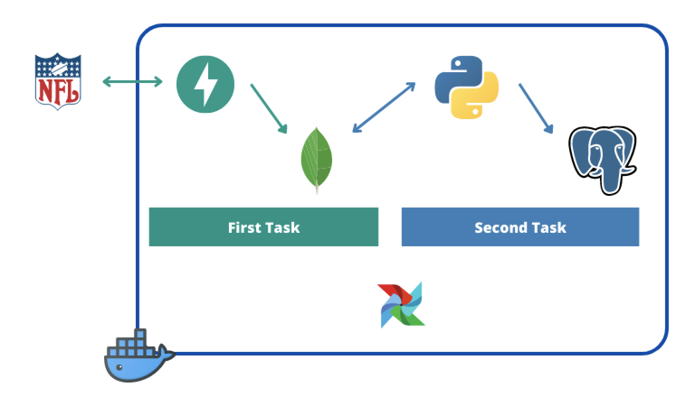

## Dependencies

* docker
* docker-compose

---

# Project Flow

The solution proposal runs an Airflow dag to fetch the external info from the NFL provider.
The external provider is called by the [League API service](#league-api) that persists this data in a
[MongoDB database](#mongo-db).

After succeeding, the second task executes the [NFL ETL script](dags/nfl_etl), applying the 
necessary transformations and merging the scoreboard with the ranking data.

The task only processes the data given by the external service on each run, and stores the 
final result in a [Postgres DB](#postgres-db).

## Overall Architecture



## Directories

```
.
├── dags                    - airflow dags
│   └── nfl_etl             - etl main directory
│       ├── core            - connections for external services
│       ├── log             - log config
│       ├── settings        - env variables
│       ├── tests           - unit tests
│       └── utils           - base functions
│
├── league_api              - league service
│   └── src                 - main directory
│       └── app             
│           ├── core        - connections for external services
│           ├── log         - log config
│           ├── models      - models to validate the payload requests 
│           ├── settings    - env variables
│           ├── tests       - unit tests
│           └── utils       - base functions
│
├── logs                    - airflow logs
├── mongo_db                - mongo db main directory
├── plugins                 - airflow plugins
└── postgresql              - postgresql main directory
```

------

# Services and connections

## Airflow:
The DAG [NFL_Dashboard](dags/nfl_dag.py) is scheduled to run every hour and fetch the data for the last 7 days.

### Connection:
Can be reached at [port 8080](http://localhost:5005)
* username: airflow
* password: airflow

## League API:
League API is a FastAPI service that gets the external data from the NFL service.

It stores the raw response json, and applies some light transformations to the ranking and scoreboard data before saving it.
Each request has a UUID bounded so each dag run can be later reprocessed and debugged.

The API is documented in Swagger, once the service is up it can be found [here](http://localhost:5005/docs).
### Sentry
With the purpose of monitoring the performance and possible unexpected errors in the deployed service, the API has been
integrated with [Sentry](https://sentry.io/for/fastapi/).

The credentials to [access the sentry project](https://sentry.io/organizations/medida/projects/league-api/?project=4504191573688321) are:

```
account: medida.etls@gmail.com
password: Medida!1234
```

### Connection
Can be reached at [port 5005](http://localhost:5005)

## Mongo DB:
Mongo DB is used to persist the NFL data from the external provider. For this test case
it is specified that the NFL data provider will always return the same data structure, but in real life
it is a safer approach to use a NoSQL database to store this type of data.

There are two databases with the following collections:
* data:
  * events: modeled scoreboard data
  * ranking: modeled ranking data
* back_up:
  * airflow_requests: responses from scoreboard and ranking endpoints

The initialization of the database can be found [here](mongo_db/set_up/mongo-init.js).

### Connection:
* host: localhost
* port: 27017
* username: medida
* password: 123456

## Postgres DB
The output of the NFL ETL script is stored here.

There is one server with one table:
* medida_etls
  * events_nfl

The initialization of the database can be found [here](postgresql/set_up/init.sql).
### Connection:
* host: localhost
* port: 5432
* username: medida
* password: medida

---

# Run

Just access the project root folder and execute:

```
docker-compose up -d
```

The first time may take some time to build all the services.

Then access the [Airflow webserver](http://localhost:8080), and trigger a new NFL_Dashboard dag run.

## Run test
In order to run the test, the following tools have to be installed:
* Python 3.9
* Poetry

### League API

1. Go to the league_api folder and run
```
poetry install
```

2. After the installation succeeds, run
```
poetry run pytest tests
```

### NFL ETL
In order to run the NFL ETL tests, the project imports inside all the files within the etl_nfl directory have to be
changed.

The change in the relative imports is to replace the _nfl_etl_ prefix. For example:
```
from nfl_etl.settings.base import MongoSettings
```
to
```
from settings.base import MongoSettings
```
This would be avoided adding the ETL code as an external dependency while building the airflow image. This would require an
additional repository and packaging the ETL code.

After that, create a new virtual environment:
```
python3 -m venv /path/to/new/virtual/environment
```
Then move to the dags folder and run

```
pytest run nfl_etl/tests
```

---
# Compromises
With the available time to develop the project, there are some aspects of the ETL that have to be mentioned.

## Pandas instead of Spark
The main reason why the ETL uses pandas instead of Spark it's because I've chosen simplicity over scalability. 

With the current limitations of the NFL external API (only returns 7 days of data) and based on the design of the project
(it only processes maximum 7 days of data on each run) there are no performance issues.

But if in the future the League API could fetch info from different data sources and increase the amount of data processed
on each run, Spark would be the best solution. In this case scenario the migration would be easy as all the transformations applied
on the ETL are encapsulated on different functions design to process Dataframes, so the code should be easy to update.

## Output stored at Postgres
With the current size of the project, Postgres is a good choice to store the output of the ETL, but eventually the volume of the
stored data will be big enough to consider saving the dashboard in a data warehouse.

---
# Next steps

## Package the ETL code
The [NFL ETL script](dags/nfl_etl) should be on its own project and packaged as a Python external library integrated in Airflow.
This way it can be updated without changing the current airflow code, and only by updating the ETL version in the requirements.

## More Airflow DAGs
The [League API service](#league-api) is prepared to fetch the data for different leagues and time ranges.
Creating a dag ready to fetch the data starting on a specific date until present, would allow the creation of full datasets
with historic data.
